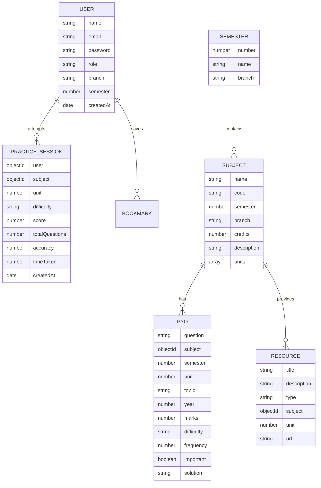

# StudyVault — Semester Academic & PYQ Management System

> **"Your Semester. Your Subjects. Your PYQs. One Place."**

[](https://opensource.org/licenses/MIT)
[](https://nodejs.org/)
[](https://tailwindcss.com/)
[](https://recharts.org/)

StudyVault is a full-stack academic platform built specifically for B.Tech and Computer Science & Engineering (CSE) college students. It provides a central hub to organize semester subjects, explore university syllabus units, download curated notes, search and filter previous-year exam questions (PYQs) across multiple years, take step-by-step interactive practice tests with instant feedback, and visualize question frequency trends with interactive charts.

---

## 🚀 Key Features

### 1. 🎓 Student Academic Dashboard
- **Personalized Overview**: Real-time stats showing active semester, branch, questions practiced, accuracy percentage, and bookmarked questions.
- **My Subjects Grid**: Current semester subjects with credits, units, PYQs count, and notes count.
- **Recent Activity Feed**: Past practice sessions and saved revision questions.

### 2. 📚 Semester & Subject Management
- **Semesters 1 to 8**: Direct navigation across all university semesters.
- **Rich Subject Hub**: Dedicated page for each subject with 6 tabs:
  - **Overview**: Course description, credit load, and unit summary.
  - **Syllabus**: Unit-by-unit (1 to 5) curriculum breakdown with key topics.
  - **Notes & Resources**: Lecture notes, syllabus schemes, and reference materials with direct download/open links.
  - **PYQ Question Bank**: In-depth previous year questions with collapsible model solutions and bookmarks.
  - **Important Topics**: High-yield topics that appear frequently in university exams.
  - **Analytics**: Topic frequency bar charts, exam year trends, and unit distribution.

### 3. 🔎 PYQ Multi-Filter & Smart Search
- **Full-Text Search**: Instant search across question text and topic keywords.
- **Multi-Filter Engine**: Filter simultaneously by:
  - Semester (1–8)
  - Subject
  - Unit (1–5)
  - Exam Year (2022–2026)
  - Marks (5, 7, 10 marks)
  - Difficulty (Easy, Medium, Hard)
  - ⭐ Important Only
  - 🔥 Frequently Asked (2+ occurrences)
- **Sorting**: By newest year, oldest year, frequency, difficulty, and marks.

### 4. 🎯 Interactive Practice Mode
- **Configurable Tests**: Select Subject → Unit → Difficulty → Number of questions (5, 10, 15, 20).
- **Exam Simulation**: Question-by-question flow with live timer, progress bar, and model answer toggles.
- **Self-Evaluation**: Mark questions as "I Solved This" or "I Struggled / Got It Wrong".
- **Revision Tracking**: Flag questions for revision; the system compiles a list of topics needing review.
- **History Log**: All test attempts are saved to MongoDB with score, accuracy %, and time taken.

### 5. 📊 Data Visualizations (Recharts)
- **Topic Frequency Bar Chart**: Top tested concepts ranked by exam appearances.
- **Questions by Year Chart**: Exam distribution across 2022–2026.
- **Unit Distribution Donut Chart**: Weightage per syllabus unit.
- **Difficulty Breakdown Chart**: Easy vs Medium vs Hard distribution.
- **Most Repeated Questions Table**: Ranked leaderboard calculated from actual question records.

### 6. 🔖 Bookmark System
- Three-tab bookmark manager for **Questions**, **Notes**, and **Resources**.
- One-click bookmark toggle across the app with persistence in MongoDB.

### 7. 🛡️ Admin Management Console
- Role-based authorization (`protect` and `adminOnly` middlewares).
- Full CRUD operations with modals and confirmation dialogs for:
  - **Semesters** (Number, name, branch)
  - **Subjects** (Name, code, credits, units, description)
  - **PYQs** (Question text, topic, year, marks, difficulty, frequency, important flag, solution)
  - **Resources** (Title, type, subject, unit, URL)
  - **Users** (Role assignment, branch, semester)
- Platform-wide statistics (total students, subjects, pyqs, resources, most practiced subject).

### 8. 🌓 Dark & Light Mode
- Complete dark and light theme support using Tailwind's `class` strategy.
- Preference persisted in `localStorage` with automatic system theme detection.

---

## 🛠️ Tech Stack

### Frontend
- **React.js (v18)** & **Vite**: Ultra-fast build and hot module replacement.
- **Tailwind CSS**: Utility-first responsive design with dark mode.
- **React Router (v6)**: Declarative client-side routing with protected route wrappers.
- **Axios**: HTTP client with request and response interceptors.
- **Lucide React**: Modern icons.
- **Recharts**: Responsive SVG charting library for analytics.

### Backend
- **Node.js** & **Express.js**: RESTful API architecture.
- **MongoDB** & **Mongoose**: Document database with relational references and aggregation pipelines.
- **JWT (jsonwebtoken)**: Stateless token-based authentication.
- **bcryptjs**: Password hashing (10 salt rounds).
- **CORS & Morgan**: Cross-origin resource sharing and HTTP request logging.

---

## 📁 Project Structure

```
studysource/
├── client/                     # React + Vite Frontend
│   ├── public/
│   │   └── favicon.svg
│   ├── src/
│   │   ├── components/         # Reusable UI (Navbar, Sidebar, Modal, ConfirmDialog, Badge, Skeleton, etc.)
│   │   ├── context/            # AuthContext, ThemeContext, ToastContext
│   │   ├── layouts/            # MainLayout (Public), DashboardLayout (App/Admin)
│   │   ├── pages/              # Landing, Auth, Dashboard, Semesters, SubjectDetail, PYQs, Practice, Bookmarks, Resources, Analytics, Admin
│   │   ├── services/           # Axios API client & endpoint helpers
│   │   ├── App.jsx             # React Router routing & route guards
│   │   ├── index.css           # Tailwind base layers & custom styles
│   │   └── main.jsx            # Entry point
│   ├── index.html
│   ├── tailwind.config.js
│   ├── postcss.config.js
│   ├── vite.config.js
│   ├── vercel.json             # Vercel SPA routing configuration
│   └── package.json
│
├── server/                     # Node.js + Express REST API Backend
│   ├── config/
│   │   └── db.js               # MongoDB Mongoose connection
│   ├── controllers/            # Business logic (auth, semesters, subjects, pyqs, resources, practice, bookmarks, analytics, users)
│   ├── middleware/             # auth (JWT), errorHandler
│   ├── models/                 # User, Semester, Subject, PYQ, Resource, PracticeSession
│   ├── routes/                 # Express route handlers
│   ├── seed/                   # Database seeder with realistic CSE/DBMS data
│   │   ├── seedData.js
│   │   └── seeder.js
│   ├── server.js               # Express application entry point
│   └── package.json
│
├── .env.example                # Configuration template
├── .gitignore                  # Git ignore rules
└── README.md                   # Project documentation
```

---

## ⚙️ Installation & Running Locally

### Prerequisites
- [Node.js](https://nodejs.org/) (v16 or higher)
- [MongoDB](https://www.mongodb.com/) running locally or a [MongoDB Atlas](https://www.mongodb.com/cloud/atlas) connection URI.

### 1. Clone the repository
```bash
git clone https://github.com/yourusername/studyvault.git
cd studyvault
```

### 2. Configure Environment Variables
Copy `.env.example` to `server/.env`:
```bash
cp .env.example server/.env
```
Ensure your `server/.env` contains:
```env
PORT=5000
NODE_ENV=development
MONGODB_URI=mongodb://localhost:27017/studyvault
JWT_SECRET=studyvault_super_secret_jwt_key_development_only_change_in_production
JWT_EXPIRE=30d
CLIENT_URL=http://localhost:5173
```

### 3. Setup Backend
```bash
cd server
npm install
# Seed the database with realistic semesters, subjects, DBMS PYQs, and demo users
npm run seed
# Start the backend server
npm run dev # or npm start
```
The server will start at `http://localhost:5000`.

### 4. Setup Frontend
Open a second terminal window:
```bash
cd client
npm install
npm run dev
```
The frontend will start at `http://localhost:5173`.

---

## 🔑 Demo Credentials (Local Development)

| Role | Email | Password |
| :--- | :--- | :--- |
| **Administrator** | `admin@studyvault.edu` | `Admin@12345` |
| **Student** | `student@studyvault.edu` | `Student@12345` |

*(Quick autofill buttons are also provided directly on the Login page for testing ease!)*

---

## 📡 REST API Documentation

### Authentication (`/api/auth`)
- `POST /api/auth/register` — Register new student
- `POST /api/auth/login` — Login and receive JWT
- `GET /api/auth/me` — Get current user profile (Protected)
- `PUT /api/auth/profile` — Update user details (Protected)

### Semesters (`/api/semesters`)
- `GET /api/semesters` — Get all semesters (1–8) with counts
- `GET /api/semesters/:number` — Get single semester with subjects
- `POST /api/semesters` — Create semester (Admin)
- `PUT /api/semesters/id/:id` — Update semester (Admin)
- `DELETE /api/semesters/id/:id` — Delete semester (Admin)

### Subjects (`/api/subjects`)
- `GET /api/subjects` — Get subjects (filter by `semester`, `branch`, `search`)
- `GET /api/subjects/:id` — Get subject with units, PYQs, and resources
- `POST /api/subjects` — Create subject (Admin)
- `PUT /api/subjects/:id` — Update subject (Admin)
- `DELETE /api/subjects/:id` — Delete subject (Admin)

### PYQs (`/api/pyqs`)
- `GET /api/pyqs` — Query PYQs with multi-filtering (`semester`, `subject`, `unit`, `year`, `marks`, `difficulty`, `important`, `frequent`, `search`, `sort`)
- `GET /api/pyqs/:id` — Get single PYQ by ID
- `POST /api/pyqs` — Create PYQ (Admin)
- `PUT /api/pyqs/:id` — Update PYQ (Admin)
- `DELETE /api/pyqs/:id` — Delete PYQ (Admin)

### Notes & Resources (`/api/resources`)
- `GET /api/resources` — Get resources (filter by `subject`, `unit`, `type`, `search`)
- `GET /api/resources/:id` — Get resource by ID
- `POST /api/resources` — Create resource (Admin)
- `PUT /api/resources/:id` — Update resource (Admin)
- `DELETE /api/resources/:id` — Delete resource (Admin)

### Practice System (`/api/practice`)
- `POST /api/practice/generate` — Generate randomized/targeted practice test (Protected)
- `POST /api/practice/submit` — Record practice score, accuracy, and revision list (Protected)
- `GET /api/practice/history` — Get student's past practice session history (Protected)

### Bookmarks (`/api/bookmarks`)
- `GET /api/bookmarks` — Get user's saved questions and notes (Protected)
- `POST /api/bookmarks/toggle` — Add or remove bookmark (Protected)
- `DELETE /api/bookmarks/:itemId` — Remove bookmark by item ID (Protected)

### Analytics & Platform Stats (`/api/analytics`)
- `GET /api/analytics/pyq` — Aggregated topic frequency, year trends, unit & difficulty distributions
- `GET /api/analytics/platform` — Total students, subjects, pyqs, resources, most practiced subject

---

## 🗄️ Database Architecture



---

## 🚀 Live Deployment Guide

### 1. Database: MongoDB Atlas
1. Create a free cluster on [MongoDB Atlas](https://www.mongodb.com/cloud/atlas).
2. Under **Network Access**, allow access from anywhere (`0.0.0.0/0`) or whitelist your host IPs.
3. Under **Database Access**, create a user with read/write privileges.
4. Copy the connection string: `mongodb+srv://<user>:<password>@cluster0.abcde.mongodb.net/studyvault?retryWrites=true&w=majority`.

### 2. Backend: Render / Railway
1. Push your code to GitHub.
2. On [Render](https://render.com/), create a **New Web Service** and connect your GitHub repository.
3. Configure settings:
   - **Root Directory**: `server`
   - **Build Command**: `npm install`
   - **Start Command**: `npm start`
4. In **Environment Variables**, add:
   - `PORT`: `5000`
   - `NODE_ENV`: `production`
   - `MONGODB_URI`: `<Your MongoDB Atlas Connection String>`
   - `JWT_SECRET`: `<A strong random secret string>`
   - `JWT_EXPIRE`: `30d`
   - `CLIENT_URL`: `<Your Vercel Frontend URL>`
5. Deploy and note your live backend URL (e.g. `https://studyvault-api.onrender.com`).

### 3. Frontend: Vercel
1. On [Vercel](https://vercel.com/), import your GitHub repository.
2. Configure settings:
   - **Root Directory**: `client`
   - **Framework Preset**: `Vite`
   - **Build Command**: `npm run build`
   - **Output Directory**: `dist`
3. In **Environment Variables**, add:
   - `VITE_API_URL`: `https://studyvault-api.onrender.com/api` (your backend URL)
4. Deploy. The included `client/vercel.json` ensures client-side routes like `/semesters`, `/pyqs`, and `/dashboard` resolve cleanly without 404 errors on refresh.

---

## 🔮 Future Improvements
- [ ] Automated PDF text extraction & OCR parsing for uploaded PYQ question papers.
- [ ] AI-assisted question answering and step-by-step mathematical reasoning.
- [ ] Peer study groups & discussion forums for difficult university problems.
- [ ] Push notifications for upcoming university exam schedules and test deadlines.

---

## 📄 License
Distributed under the MIT License. See `LICENSE` for more information.
